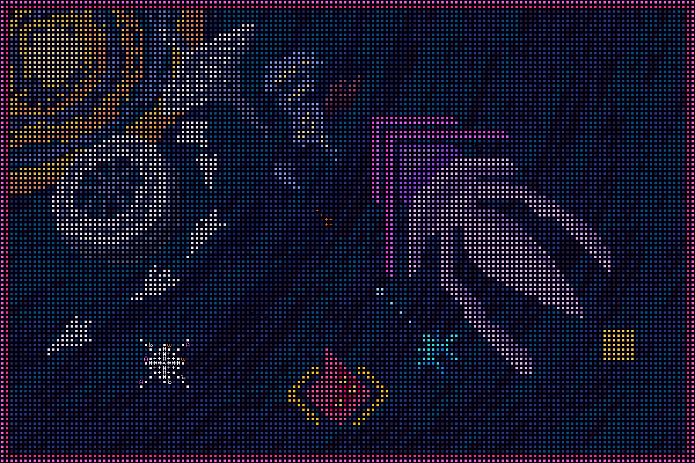

# Rogue Frontier

[Itch.io](https://ineedauniqueusername.itch.io/rogue-frontier)

_Rogue Frontier_ is an ambitious ASCII-style rogue-lite space adventure set in an alternate universe of *Transcendence*, a space-opera roguelike by George Moromisato.

This game is in early alpha demo, with most UI elements and essential gameplay mechanics implemented. Story is currently in planning.

## Build
- Visual Studio 2019
- MonoGame
- SadConsole
- [ArchConsole](https://github.com/INeedAUniqueUsername/ArchConsole)
- [ASECII](https://github.com/INeedAUniqueUsername/ASECII)

## Play
Download and extract the ZIP archive. Run RogueFrontier.exe to play.
